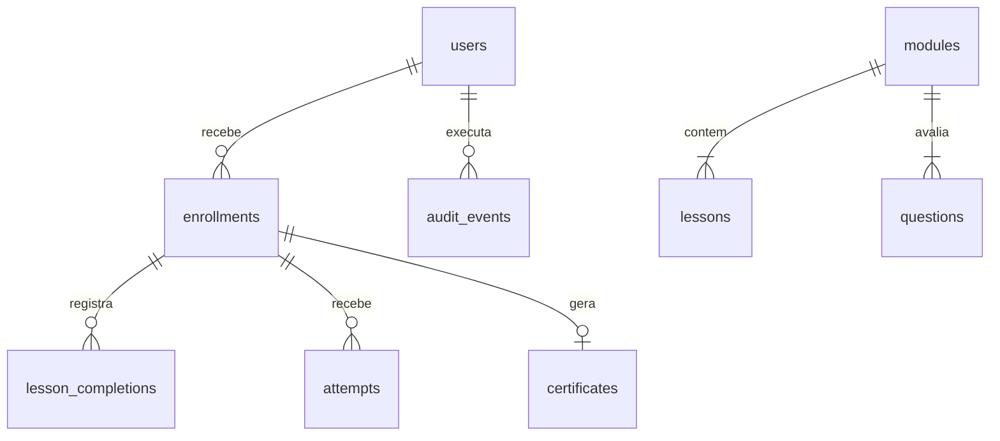

# Estrutura do banco

O arquivo `backend/src/schema.sql` é a definição executável. A conexão ativa chaves estrangeiras, journal WAL e espera de até 5 segundos por bloqueios de escrita. Consultas usam parâmetros, sem concatenar entradas do usuário no SQL.

| Tabela | Responsabilidade e campos principais |
|---|---|
| users | Identidade, e-mail único, hash de senha, perfil, cargo, ativo, versão de sessão, criação e última atividade |
| modules | Ordem única, título, duração estimada, nota mínima e limite de tentativas |
| lessons | Conteúdo textual e ordem de cada aula; FK para módulo |
| questions | Enunciado, alternativas JSON e índice correto; FK para módulo |
| enrollments | Matrícula/ciclo: colaborador, número, responsável, motivo, atribuição, prazo, conclusão, arquivamento e cópia do catálogo |
| lesson_completions | Uma conclusão por aula e ciclo; data registrada pelo servidor |
| attempts | Ciclo, módulo, número, respostas, nota calculada, aprovação e data |
| certificates | UUID único, ciclo único, nome do participante na emissão e data |
| audit_events | Ator, ação, alvo, detalhes e data de mudanças administrativas |
| help_requests | Dúvida com autor, ciclo, módulo, texto e criação; consultável pela gestão |

## Relações

Além de `user_id`, a matrícula tem `assigned_by`, referenciando quem atribuiu a trilha. O índice parcial `one_current_cycle` garante no máximo um ciclo sem arquivamento por colaborador. A combinação usuário/ciclo é única. Uma conclusão de aula é única por ciclo/aula, impedindo duplicação por dois cliques. A combinação ciclo/módulo/número é única para tentativas; o certificado é único por ciclo.

## Por que guardar uma cópia do catálogo?

`catalog_json` contém módulos, aulas, questões, respostas corretas e regras no instante da atribuição. Nunca é enviado integralmente ao navegador. Se o gestor mudar o limite de tentativas amanhã, a avaliação de ontem precisa continuar explicável. As consultas e correções de cada ciclo usam sua cópia, não o catálogo atual.

Os IDs de aula/módulo em progresso e tentativas são referências lógicas ao snapshot do ciclo, validadas no servidor; deliberadamente não têm FK para o catálogo mutável. Em contrapartida, sempre há FK para a matrícula. Essa é uma decisão de simplificação: um modelo maior poderia ter tabelas de versões imutáveis de cada conteúdo.

## Datas e transações

Datas persistidas em ISO 8601 UTC. A interface apresenta datas em português no fuso do navegador. O formulário de prazo converte o fim do dia de Brasília (`23:59:59-03:00`) para UTC. A API aceita data/hora ISO com fuso, exigindo prazo futuro para cadastro/alteração. Somente o seed fabrica um exemplo já atrasado.

Concluir uma avaliação, verificar limite, inserir tentativa, concluir a trilha e emitir certificado ocorre em uma transação `BEGIN IMMEDIATE`. Não há `await` dentro dela. A operação é serializada e ou grava tudo, ou desfaz tudo. Cadastro com trilha e reciclagem também são transacionais.

Não há rotina de apagamento nem reset de produção. O seed é idempotente em uma base já populada. Para outra demonstração limpa, aponte `DATABASE_PATH` para um arquivo novo e execute o seed; preserve o anterior. Migrações evolutivas não estão implementadas nesta versão acadêmica: `CREATE TABLE IF NOT EXISTS` inicializa uma base nova, mas não transforma esquemas antigos.
